# Hardware Implementation of Convolutional Neural Network as Part of SoC Design for ECG Analysis and Classification

**Marly Barsoum**

Department of Electrical, Computer and Biomedical Engineering
Faculty of Engineering and Architectural Science
Toronto Metropolitan University, 2026

Computer/Electrical Engineering Capstone Design Project

---

## Acknowledgements

I would like to thank my supervisor and the department for providing access to the Altera DE2 development board and Quartus Prime software used throughout this project.

The ECG classification framework used to train and evaluate the ZolotyhNet model was developed by Lyashuk and Zolotykh at the National Research University — Higher School of Economics. The ZolotyhNet architecture itself is named in honour of PI Nikolai Yu. Zolotykh. The open-source ecg-classification repository provided a structured and reproducible training pipeline that this project builds on directly.

The MIT-BIH Arrhythmia Database, accessed through PhysioNet, was essential for both model training and system testing.

---

## Certification of Authorship

I certify that the work presented in this report is my own original work, conducted as part of the Capstone Design Project at Toronto Metropolitan University. All external sources have been cited appropriately.

**Marly Barsoum**
Toronto Metropolitan University, 2026

---

## Table of Contents

1. Abstract
2. Introduction & Background
3. Objectives
4. Theory and Design
5. Alternative Designs
6. Material/Component List
7. Measurement and Testing Procedures
8. Performance Measurement Results
9. Analysis of Performance
10. Conclusions
11. References
12. Appendices

---

## Abstract

Electrocardiogram (ECG) signal analysis is one of the most important tools in cardiovascular diagnostics, but interpreting recordings manually requires trained cardiologists and introduces delays in clinical settings. Automated arrhythmia classification using machine learning offers a path toward faster and more accessible cardiac monitoring. This project investigates the implementation of a Convolutional Neural Network (CNN) hardware accelerator on a Field-Programmable Gate Array (FPGA) as part of a System-on-Programmable-Chip (SoPC) design for real-time ECG classification.

The system architecture consists of two main components. On the software side, a Python application running on a PC reads ECG recordings from the MIT-BIH Arrhythmia Database, preprocesses the signals, visualizes them in real time on screen, and streams samples to the FPGA at 360 Hz over a UART serial connection. On the hardware side, a dual-path CNN called ZolotyhNet — implemented entirely in VHDL — receives the incoming ECG samples, buffers 128 samples per heartbeat window, and classifies each beat into one of eight arrhythmia categories.

The ZolotyhNet architecture consists of an upper convolutional path with five Conv1D layers and four max-pooling operations, and a lower fully-connected path with three linear layers. Both paths operate on the same 128-sample input, and their outputs are fused element-wise before a final classifier layer produces a class prediction. The network's approximately 14,700 parameters are stored entirely in on-chip M4K memory blocks after quantization to a Q8.8 fixed-point format, eliminating the need for external memory.

The implemented system achieves 95.75% overall classification accuracy on the MIT-BIH validation set of 9,368 samples. On the Altera DE2 Cyclone II FPGA, the design uses 13% of available Logic Elements and 61% of M4K memory blocks. Each 128-sample inference window is processed in approximately 2.2 milliseconds at 50 MHz. Classification results are displayed on the board's 16×2 LCD as "Normal" or "Abnormal" and indicated through the green LED array.

Testing was performed across approximately 32 different MIT-BIH ECG records covering multiple arrhythmia types, confirming correct end-to-end operation of the system.

**Keywords:** FPGA, CNN, ECG classification, fixed-point arithmetic, hardware accelerator, MIT-BIH

---

## Introduction & Background

This chapter introduces the motivation behind this project, provides background on ECG signals and arrhythmia types, surveys relevant prior work in CNN-based ECG classification, and discusses why FPGA-based hardware acceleration is well-suited for this application. The chapter is organized as follows: Section 1.1 covers cardiovascular disease and the clinical role of ECG, Section 1.2 describes the eight arrhythmia classes used in this project, Section 1.3 reviews CNN-based classification approaches from the literature, and Section 1.4 discusses FPGA acceleration for neural network inference.

### 1.1 Cardiovascular Disease and the ECG

Cardiovascular disease (CVD) is the leading cause of death worldwide, responsible for an estimated 17.9 million deaths annually according to the World Health Organization. Early detection of arrhythmias — abnormal heart rhythms — is critical for preventing serious complications like stroke, heart failure, and sudden cardiac arrest. The electrocardiogram (ECG) is the most widely used non-invasive tool for detecting these conditions. It records the electrical activity of the heart over time using electrodes placed on the skin, producing a waveform that reflects how electrical impulses travel through the cardiac tissue.

A normal ECG waveform has a well-defined structure. The P wave represents atrial depolarization, the QRS complex corresponds to ventricular depolarization (the main contraction), and the T wave reflects ventricular repolarization. Deviations from this typical morphology, in terms of amplitude, duration, or timing, indicate specific arrhythmia types. For example, a widened or notched QRS complex is a hallmark of bundle branch blocks, while an early, wide, and unusually shaped QRS complex suggests a premature ventricular contraction.

Interpreting ECG recordings manually requires trained cardiologists, which becomes a bottleneck in high-volume clinical settings and is entirely impractical for continuous ambulatory monitoring. A patient wearing a Holter monitor for 24 hours generates hundreds of thousands of heartbeats — reviewing all of them manually is not feasible. This has motivated significant research into automated ECG classification using machine learning, and more recently, deep learning approaches.

The MIT-BIH Arrhythmia Database [1], hosted on PhysioNet, is the most widely used benchmark dataset for this task. It contains 48 half-hour recordings from 47 subjects, sampled at 360 Hz, with each beat annotated by expert cardiologists. The database covers a wide range of arrhythmia types and has been the foundation for most published work in automated ECG classification.

### 1.2 Arrhythmia Classes in This Project

This project uses the eight-class classification scheme defined by the MIT-BIH annotations, following the mapping used in the ecg-classification framework [4]:

- **N — Normal sinus beat**: The reference class. Regular P-QRS-T morphology with normal timing intervals. Represents approximately 70% of the MIT-BIH validation data used here.
- **L — Left Bundle Branch Block (LBBB)**: Delayed conduction through the left bundle branch produces a wide, notched QRS complex. Characteristic broad, upright R wave in lateral leads.
- **R — Right Bundle Branch Block (RBBB)**: Delayed right-side conduction. Wide QRS with a prominent R' in V1. Morphologically distinct from LBBB.
- **V — Premature Ventricular Contraction (PVC)**: An early, wide, and abnormally shaped QRS complex originating from the ventricles. No preceding P wave. Clinically significant if frequent.
- **A — Atrial Premature Beat (APB)**: An early beat originating in the atria. Narrow QRS but with an abnormal or absent P wave.
- **E — Ventricular Escape Beat (VEB)**: A safety beat that occurs when the normal pacemaker fails. Wide QRS, typically delayed.
- **! — Ventricular Flutter Wave**: An extreme arrhythmia with a very rapid, regular, sinusoidal ventricular waveform.
- **\_ — Unclassified/Other**: Beats that do not fit the above categories.

For the board output, these eight classes are simplified to two display categories: Normal (class N only) and Abnormal (all others). This is because the practical clinical decision — at a first-pass screening level — is whether a beat looks normal or requires further attention.

### 1.3 CNN-Based ECG Classification — Prior Work

Applying CNNs to ECG classification has been an active research area since around 2017. Hannun et al. [2] demonstrated that a 34-layer 1D CNN could match or exceed cardiologist performance on a private 12-lead dataset, sparking wide interest in deep learning for cardiac monitoring. On the MIT-BIH benchmark specifically, multiple architectures have been proposed.

The ecg-classification framework by Lyashuk and Zolotykh [4] provides a systematic comparison of seven different model architectures on the same MIT-BIH preprocessing pipeline. Table 1.1 summarises the key results relevant to this project.

**Table 1.1: Comparison of CNN models for MIT-BIH ECG classification.**

| Model | Input Type | Approx. Parameters | Val. Accuracy | FPGA Feasible |
|-------|------------|-------------------|---------------|---------------|
| HeartNet (arXiv 1707.01836) [2] | 1D, 128 samples | ~1M | 98.27% | No |
| HeartNetIEEE [3] | 1D, 128 samples | ~500K | 98.64% | No |
| EcgResNet34 [4] | 1D, 128 samples | ~500K | 99.38% | No |
| ZolotyhNet (this work) | 1D, 128 samples | ~14,700 | 95.75% | **Yes** |

The accuracy gap between ZolotyhNet and EcgResNet34 (3.63%) reflects a deliberate design trade-off, discussed in detail in later chapters. The key constraint is that EcgResNet34's ~500K parameters cannot fit within the on-chip M4K memory of the Cyclone II FPGA, making ZolotyhNet the only architecture in this comparison that can be fully deployed without external memory.

### 1.4 FPGA-Based Neural Network Acceleration

FPGAs offer several advantages over CPUs and GPUs for neural network inference in embedded applications. They provide deterministic latency — unlike software running on a CPU, an FPGA-based inference engine completes in a fixed number of clock cycles every time. They also consume significantly less power than a GPU, and they can be reprogrammed to match the exact structure of the target network.

The main challenge with FPGA deployment is that standard neural networks use 32-bit floating-point arithmetic, which is expensive to implement in logic. FPGA designs for CNN inference almost universally convert to fixed-point arithmetic, accepting a small accuracy loss in exchange for dramatically reduced hardware area and higher throughput [5, 6].

The Altera DE2 board used here contains a Cyclone II EP2C35F672C6 FPGA [6] with 33,216 Logic Elements (LEs) and 105 M4K embedded memory blocks (4 Kbit each). This gives a total of approximately 52.5 KB of on-chip RAM, which sets a hard limit on how many weight parameters can be stored on-chip. The M4K blocks are also used for intermediate activation buffers between layers, so the effective budget for weights is somewhat less than the full 52.5 KB.

The HD44780 LCD controller [7] on the DE2 board provides a simple 16×2 character display that is used here to show the classification result to the user. The Terasic DE2 User Manual [6] was used as the primary reference for board peripherals and pin assignments throughout this project.

The GK02 paper [5], "Hardware Implementation of CNN as Part of SoC Design for ECG Analysis," provides a directly relevant prior example of deploying a CNN on an FPGA for ECG classification. This project builds on that concept and implements it with the specific ZolotyhNet architecture and a complete end-to-end system including Python-based signal streaming and real-time classification.

---

## Objectives

The following objectives guided the design and implementation of this project:

1. Study ECG signal characteristics and arrhythmia classification requirements using the MIT-BIH Arrhythmia Database [1], and identify the computationally intensive components suitable for hardware acceleration.

2. Design and train ZolotyhNet — a dual-path CNN architecture specifically architected for FPGA resource constraints — and evaluate its classification accuracy on the MIT-BIH validation set.

3. Implement Q8.8 fixed-point weight quantization and export the trained network weights to Altera Memory Initialization File (MIF) format for storage in on-chip M4K ROM blocks.

4. Implement the complete CNN hardware accelerator in VHDL on the Altera DE2 (Cyclone II) FPGA, including both the convolutional upper path and the fully-connected lower path, with time-multiplexed MAC engines and 18 on-chip weight ROMs.

5. Implement the PC-side signal processing pipeline in Python: reading MIT-BIH ECG recordings, preprocessing and normalizing the signal, displaying a real-time scrolling waveform on screen, and streaming 12-bit samples to the FPGA at 360 Hz over a UART serial connection.

6. Demonstrate real-time ECG classification by streaming ECG records from the PC to the board, classifying each 128-sample beat window, and displaying the result on the board's LCD and green LED array.

7. Verify system performance by testing approximately 32 different MIT-BIH ECG records covering multiple arrhythmia types, and characterize classification accuracy using a confusion matrix and per-class accuracy metrics.

---

## Theory and Design

This chapter presents the theoretical foundations and implementation details of the complete system. It covers the dataset and preprocessing pipeline, the ZolotyhNet CNN architecture and its training, the fixed-point weight quantization process, and a detailed description of every hardware module implemented on the FPGA. The chapter closes with a summary of the software-hardware co-design flow that ties everything together.

### 3.1 System Architecture Overview

The overall system consists of two distinct subsystems, as shown in Figure 3.1: a Python application running on a PC, and a CNN hardware accelerator implemented on the Altera DE2 FPGA board. The two subsystems communicate through an RS-232 serial connection operating at 115,200 baud.

**Figure 3.1: System Architecture Block Diagram.**

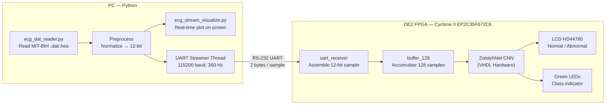

On the PC side, the Python script `ecg_stream_visualize.py` handles three tasks simultaneously: loading the ECG recording, displaying it as a scrolling waveform in a matplotlib window, and sending samples to the board at 360 Hz via a serial port. These two activities — visualization and streaming — run on separate threads to keep both responsive.

On the FPGA side, the hardware receives each sample as a 12-bit value over UART, accumulates 128 samples into a circular buffer, and then triggers the CNN inference engine. The result is a 3-bit class index (0–7) that gets mapped to one of four display categories and shown on the LCD and LEDs.

### 3.2 MIT-BIH Dataset and Signal Preprocessing

#### 3.2.1 The MIT-BIH Arrhythmia Database

The MIT-BIH Arrhythmia Database [1] is the primary data source for this project. It contains 48 ambulatory ECG recordings, each approximately 30 minutes long, sampled at 360 Hz. Each recording consists of two leads; this project uses the MLII lead (modified limb lead II), which gives the clearest view of the P wave and QRS complex for most patients.

The recordings are stored in a binary format with a separate header file (`.hea`) describing the signal parameters. Three different encoding formats exist across the dataset:

- **Format 212**: The most common. Every three bytes encode two 12-bit samples in a packed arrangement. The lower 12 bits of the first sample occupy the first byte and the lower nibble of the second byte; the upper byte and upper nibble encode the second sample.
- **Format 310**: Four bytes encode three 10-bit samples. Less common.
- **Format 16**: Each 16-bit little-endian word is a single sample. Straightforward but less space-efficient.

The `ecg_dat_reader.py` file implements a parser for all three formats. After reading the raw ADC values, the signal is converted to physical units using the formula:

```
physical_value (mV) = (ADC_raw - ADC_zero - baseline) / gain
```

where `gain` is typically 200 ADC units per millivolt. The resulting signal is in millivolts.

Table 3.1 shows the class distribution in the validation set used for testing.

**Table 3.1: MIT-BIH class distribution in the validation set (9,368 samples).**

| Class | Label | Description | Samples | % of Total |
|-------|-------|-------------|---------|------------|
| 1 | N | Normal sinus beat | 6,559 | 70.0% |
| 2 | L | LBBB | 807 | 8.6% |
| 3 | R | RBBB | 573 | 6.1% |
| 4 | V | PVC | 703 | 7.5% |
| 0 | _ | Unclassified | 419 | 4.5% |
| 5 | A | APB | 249 | 2.7% |
| 7 | ! | Ventricular Flutter | 47 | 0.5% |
| 6 | E | Ventricular Escape | 11 | 0.1% |

The class imbalance is severe — Normal beats make up 70% of the dataset, while VEB (E) has only 11 samples in the entire validation set. This has significant implications for per-class accuracy, discussed in Chapter 7.

#### 3.2.2 R-Peak Detection and Beat Windowing

Each 128-sample window fed to the CNN is extracted by centering on a detected R-peak. The R-peak is the tallest part of the QRS complex and is easy to detect algorithmically. The preprocessing script uses `scipy.signal.find_peaks()` with a minimum inter-peak distance of 180 samples, which corresponds to a maximum heart rate of 200 BPM at 360 Hz.

Each window spans indices [PEAK − 64, PEAK + 64], giving 128 samples total. At 360 Hz, 128 samples covers about 356 ms, which is enough to capture the full P-QRS-T complex of one heartbeat with some context on either side. Windows near the edges of the recording are discarded to avoid boundary issues.

The dataset is split 90% for training and 10% for validation, stratified per class to maintain class proportions.

**Figure 3.2: Representative ECG beat windows for each arrhythmia class (128-sample, 360 Hz, centered on R-peak).**

*[Note for final report: Generate this as a matplotlib 8-panel figure using actual MIT-BIH samples from the ECG signals folder. Each panel: 128 samples on x-axis, amplitude in mV on y-axis, class label as title. Annotate P, QRS, T on the Normal panel.]*

#### 3.2.3 PC-Side Signal Preprocessing

The Python script `ecg_stream_visualize.py` processes the loaded signal along two separate paths. This separation is intentional — the display should show the true signal amplitude, while the FPGA receives a consistent normalized range regardless of the source recording.

**Display path**: The raw physical values in millivolts are passed directly to the matplotlib animation buffer. The Y-axis is scaled to the 1st–99th percentile of the full recording, with a 10% padding on each side. This avoids the Y-axis being distorted by occasional outlier samples while still showing the full dynamic range of the signal.

**UART path**: The signal is first min-max normalized to the range [−1, +1]:

```
ecg_norm = 2.0 × (ecg_data − min) / (max − min) − 1.0
```

Then scaled to a 12-bit signed integer:

```
ecg_12bit = clip(ecg_norm × 2047, −2048, +2047)
```

The resulting value is packed into two bytes for serial transmission, as described in Section 3.5.2.

The script uses a producer-consumer threading model. The `ECGStreamer` class runs as a daemon thread that sends samples at 360 Hz using `time.sleep(1/360)` for pacing and pushes display values into a thread-safe queue (maximum 2000 items). The `ECGVisualizer` class runs on the main thread — a requirement imposed by matplotlib — and drains the queue to update the scrolling plot.

**Figure 3.3: PC-side signal preprocessing pipeline.**

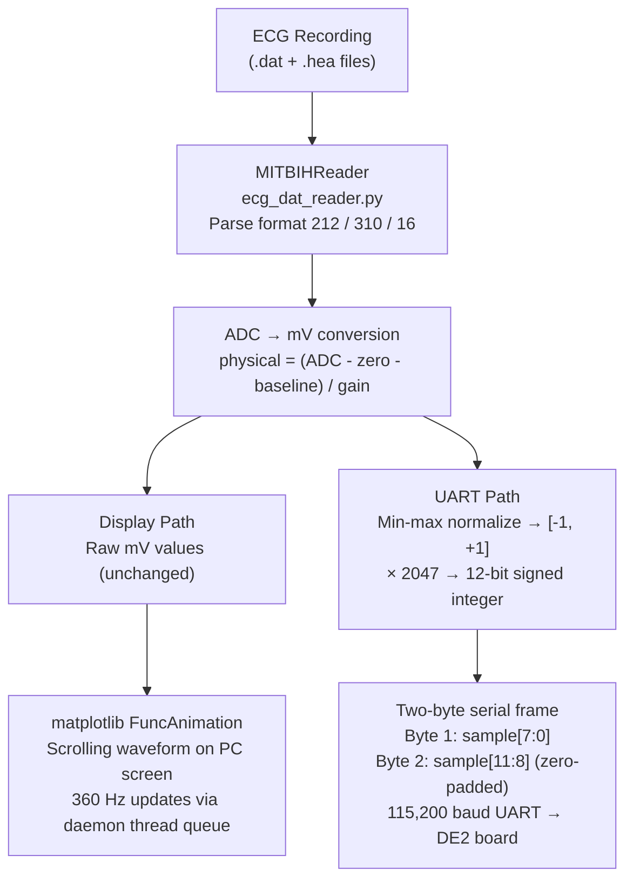

### 3.3 ZolotyhNet CNN Architecture

#### 3.3.1 Design Motivation

The central design challenge for this project is fitting a usable CNN into the resource envelope of the Cyclone II FPGA. The most accurate architecture evaluated in the ecg-classification framework is EcgResNet34, with 99.38% accuracy. But its ~500,000 parameters, stored at 16 bits each, would require about 1 MB of memory. The Cyclone II has only 105 M4K blocks (approximately 52 KB total), so EcgResNet34 is simply not deployable here.

ZolotyhNet was chosen specifically because it was designed as a compact, FPGA-friendly alternative within the same framework. Its dual-path structure — combining local feature extraction from convolutions with global feature extraction from fully-connected layers — allows it to extract useful representations without needing deep residual blocks or large kernels.

#### 3.3.2 Network Architecture

The ZolotyhNet architecture is shown in Figure 3.4. The network has two parallel processing paths operating on the same 128-sample input, whose outputs are fused before the final classification step.

**Figure 3.4: ZolotyhNet dual-path CNN architecture.**

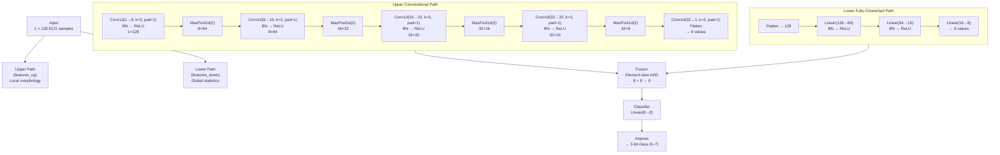

**Upper path** (`features_up`): Five Conv1D layers with kernel size 3 and padding 1, each followed by Batch Normalization and ReLU. Four MaxPool1d(2) operations progressively halve the temporal dimension: 128 → 64 → 32 → 16 → 8. The final Conv1D reduces to a single channel, and the 8 remaining spatial positions are flattened to produce 8 values.

**Lower path** (`features_down`): The full 128-sample input is flattened and passed through three linear layers (128→64→16→8), each with Batch Normalization and ReLU. This path captures global signal statistics — things like overall amplitude distribution and mean waveform shape — that the convolutional path might miss.

**Fusion**: The 8-element outputs of both paths are added element-wise: `out_middle = out_up + out_down`. This is not concatenation — it is a direct sum, so the fused representation remains 8 elements wide.

**Classifier**: A final Linear(8→8) layer maps the fused features to 8 class scores. The predicted class is the index of the maximum score (Argmax).

#### 3.3.3 Parameter Count

The total parameter count of ZolotyhNet is approximately 14,705. Table 3.2 gives the breakdown.

**Table 3.2: ZolotyhNet parameter count by layer.**

| Layer | Shape | Parameters |
|-------|-------|-----------|
| conv0_weight + bias | 8×1×3 + 8 | 32 |
| conv1_weight + bias | 16×8×3 + 16 | 400 |
| conv2_weight + bias | 32×16×3 + 32 | 1,568 |
| conv3_weight + bias | 32×32×3 + 32 | 3,104 |
| conv4_weight + bias | 1×32×3 + 1 | 97 |
| linear0_weight + bias | 64×128 + 64 | 8,256 |
| linear1_weight + bias | 16×64 + 16 | 1,040 |
| linear2_weight + bias | 8×16 + 8 | 136 |
| classifier_weight + bias | 8×8 + 8 | 72 |
| **Total** | | **~14,705** |

For comparison, EcgResNet34 has approximately 500,000 parameters — about 34× more.

#### 3.3.4 Training Configuration

Training was performed using the PyTorch framework [4]. The optimizer was Adam with a learning rate of 1×10⁻³. CrossEntropyLoss was used as the loss function, with a batch size of 128. The dataset was split 90% for training and 10% for validation, stratified by class. Model checkpoints were saved after each epoch in `.pth` format, and training progress was logged to TensorBoard.

The trained checkpoint used for all subsequent hardware deployment is located at `experiments/ZolotyhNet/checkpoints/00000000.pth`.

### 3.4 Weight Quantization and MIF Export

The trained PyTorch model uses 32-bit floating-point arithmetic. To deploy the weights on the FPGA, they must be converted to a fixed-point integer format that hardware can compute with efficiently.

#### 3.4.1 Q8.8 Fixed-Point Representation

This project uses the Q8.8 fixed-point format: a 16-bit signed integer where 8 bits represent the integer portion and 8 bits represent the fractional portion.

**Figure 3.5: Q8.8 fixed-point format.**

```
Bit 15  | Bits 14–8        | Bits 7–0
--------|------------------|------------------
Sign    | Integer (7 bits) | Fractional (8 bits)
```

- Range: −128.0 to +127.99609375
- Resolution: 1/256 ≈ 0.00390625
- Conversion from float: `fixed = round(float_val × 256).astype(int16)`
- Example: 0.5 → round(0.5 × 256) = 128 = 0x0080
- Example: −0.25 → round(−0.25 × 256) = −64 = 0xFFC0 (two's complement)

ECG classification weights are typically small values — most fall in the range −1 to +1. The Q8.8 format gives 256 distinct values within that range, providing a resolution of 0.004. This is sufficient to represent the weights with acceptable accuracy.

The multiply-accumulate operation works as follows. Multiplying two Q8.8 values produces a Q16.16 result (32-bit):

```
product = weight_Q8.8 × input_Q8.8  →  result_Q16.16 (32-bit)
```

To convert back to Q8.8, the result is right-shifted by 8 bits:

```
output_Q8.8 = product[31:8]  (take upper 24 bits, use bits 23–8)
```

**Figure 3.6: Q8.8 multiply-accumulate pipeline.**

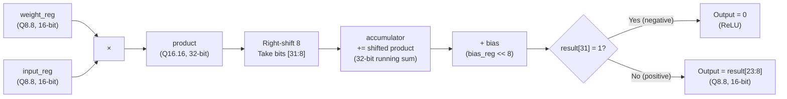

#### 3.4.2 Weight Export Pipeline

The script `extract_weights.py` walks the trained PyTorch model and exports each layer's weights and biases to individual MIF files. It identifies Conv1d and Linear layers by type, extracts the `.weight.data.numpy()` and `.bias.data.numpy()` tensors, converts them to Q8.8 integers, and writes them in Quartus MIF format.

**Figure 3.7: Weight export pipeline.**

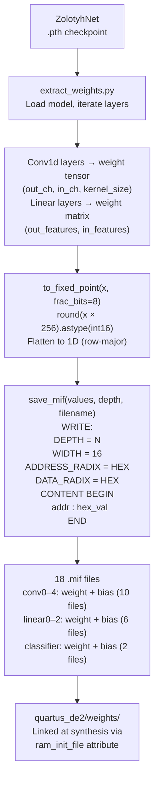

Table 3.3 shows the memory footprint of each weight file.

**Table 3.3: Weight memory footprint per layer.**

| Layer | Tensor Shape | Entries | Est. M4K Blocks |
|-------|-------------|---------|----------------|
| conv0_weight | 8×1×3 | 24 | 1 |
| conv0_bias | 8 | 8 | 1 |
| conv1_weight | 16×8×3 | 384 | 1 |
| conv1_bias | 16 | 16 | 1 |
| conv2_weight | 32×16×3 | 1,536 | 1 |
| conv2_bias | 32 | 32 | 1 |
| conv3_weight | 32×32×3 | 3,072 | 2 |
| conv3_bias | 32 | 32 | 1 |
| conv4_weight | 1×32×3 | 96 | 1 |
| conv4_bias | 1 | 1 | 1 |
| linear0_weight | 64×128 | 8,192 | 4 |
| linear0_bias | 64 | 64 | 1 |
| linear1_weight | 16×64 | 1,024 | 1 |
| linear1_bias | 16 | 16 | 1 |
| linear2_weight | 8×16 | 128 | 1 |
| linear2_bias | 8 | 8 | 1 |
| classifier_weight | 8×8 | 64 | 1 |
| classifier_bias | 8 | 8 | 1 |

The `linear0_weight` ROM, with 8,192 entries at 16 bits each, is the largest single memory consumer — requiring approximately 4 M4K blocks (128 Kbit of data, with each M4K providing 4 Kbit).

### 3.5 FPGA Hardware Architecture

This section describes every VHDL module in the hardware system, from the top-level entity down to the individual computational engines. The overall module hierarchy is shown in Figure 3.8.

**Figure 3.8: FPGA module hierarchy.**

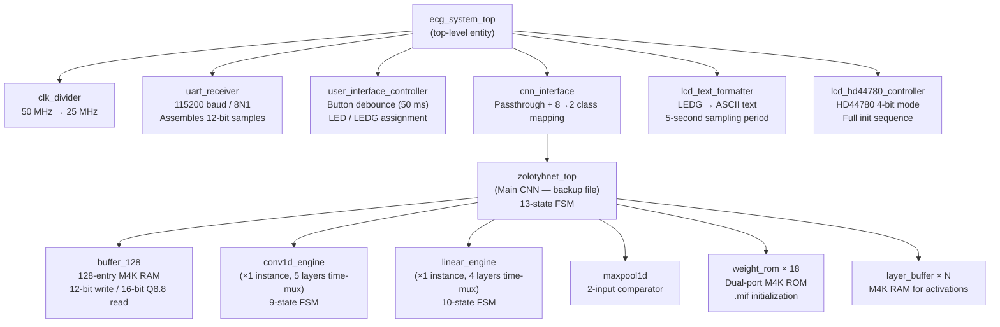

#### 3.5.1 Top-Level System

The top-level entity `ecg_system_top` instantiates all major subsystems and connects them. The clock input is 50 MHz from the DE2 board's primary oscillator. A `clk_divider` module (toggle flip-flop) divides this to 25 MHz for internal timing. An active-low reset (`reset_n`) is connected to one of the push-button inputs.

The UART receiver, CNN interface, user interface controller, LCD formatter, and LCD controller are all connected through internal signals defined in the architecture. The CNN result flows from `zolotyhnet_top` → `cnn_interface` → `user_interface_controller` → `lcd_text_formatter` → `lcd_hd44780_controller`.

#### 3.5.2 UART Receiver

The `uart_receiver` module handles reception of ECG samples from the PC. It is parameterised by `CLK_FREQ` (50,000,000) and `BAUD_RATE` (115,200), giving:

```
CLKS_PER_BIT = 50,000,000 / 115,200 = 434 clock cycles per bit
```

The module implements two nested state machines.

**FSM 1 — Byte-level UART receiver:**

**Figure 3.9: UART byte-level FSM.**

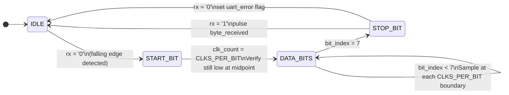

Eight data bits are received LSB-first. After the stop bit is verified, a one-clock `byte_received` pulse is issued.

**FSM 2 — Sample assembly:**

**Figure 3.10: UART sample assembly FSM.**

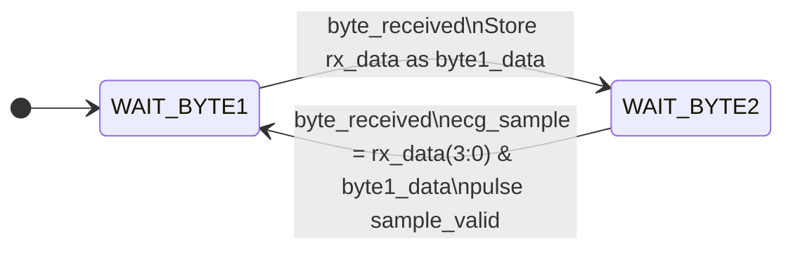

Each 12-bit sample arrives as two bytes. The Python sender transmits:
- Byte 1: `sample_u & 0xFF` (lower 8 bits)
- Byte 2: `(sample_u >> 8) & 0x0F` (upper 4 bits, zero-padded to 8 bits)

The FPGA assembles these as `ecg_sample[11:0] = rx_data(3:0) & byte1_data`.

**Figure 3.11: UART two-byte protocol timing diagram.**

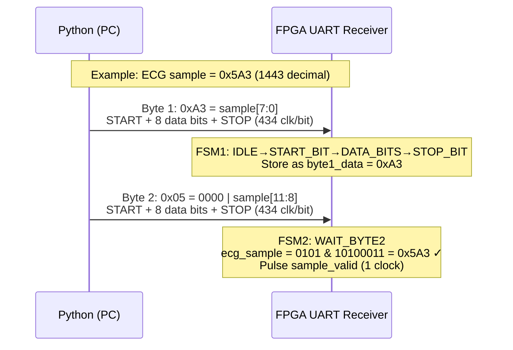

#### 3.5.3 Input Sample Buffer

The `buffer_128` module is a 128-entry circular dual-port M4K RAM. The write port accepts 12-bit raw samples from the UART receiver. The read port outputs 16-bit Q8.8 values for consumption by the CNN engines.

The conversion from raw to Q8.8 happens in a 3-clock pipeline:
1. Read 12-bit raw value from RAM
2. Sign-extend to 16 bits (replicate bit 11 into bits 15–12)
3. Arithmetic right-shift by 4 (equivalent to dividing by 16)

This maps the 12-bit signed range [−2048, +2047] into the Q8.8 range [−128.0, +127.9375], fitting entirely within the 8-bit integer portion.

When 128 samples have been accumulated and the CNN is in its IDLE state, the module asserts `buffer_ready` to trigger the next inference run.

#### 3.5.4 Conv1D Engine

The `conv1d_engine` is the core compute block for the convolutional layers. A single instance handles all five Conv1D layers sequentially — the CNN control FSM reconfigures its generic parameters (input channels, output channels, input length) for each layer.

The engine implements a time-multiplexed Multiply-Accumulate (MAC) unit using a 9-state FSM.

**Figure 3.12: Conv1D engine state machine.**

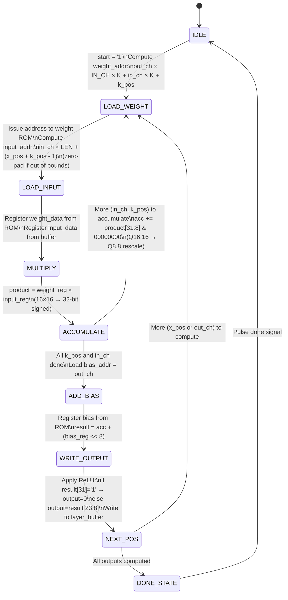

The accumulator is 32 bits wide to prevent overflow during the sum of up to `IN_CHANNELS × KERNEL_SIZE` products. After the bias is added, ReLU is applied by checking the sign bit: if the result is negative (bit 31 = 1), the output is clamped to zero. The final output is the 16-bit slice `result[23:8]`, which is the Q8.8 value.

#### 3.5.5 Linear Engine

The `linear_engine` handles the fully-connected layers. Like the Conv1D engine, one instance is time-multiplexed for all four linear layers (Linear1, Linear2, Linear3, and the Classifier). It uses a 10-state FSM that is structurally similar to the Conv1D engine.

**Figure 3.13: Linear engine state machine.**

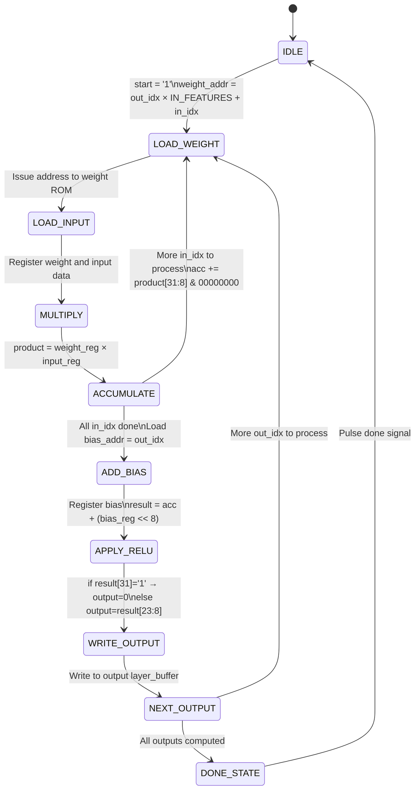

The main difference from the Conv1D engine is the explicit `APPLY_RELU` state. The Classifier layer (the final Linear(8→8)) does not use ReLU — the control FSM omits it when running the classifier stage before Argmax.

#### 3.5.6 Max Pooling

The `maxpool1d` module is a simple combinational block. It takes two parallel signed 16-bit inputs (`input_0`, `input_1`) and outputs the larger of the two. The result is registered on the clock edge. Pool size is 2 with stride 2, so each pooling stage halves the temporal dimension.

The upper path uses four pooling operations: 128 → 64 → 32 → 16 → 8 samples.

#### 3.5.7 Weight ROM

The `weight_rom` module is a dual-port synchronous ROM initialized from a MIF file at synthesis time. It uses two Quartus-specific VHDL attributes to ensure correct hardware inference:

```vhdl
attribute ram_init_file of rom_data : signal is INIT_FILE;
attribute ramstyle       of rom_data : signal is "M4K";
```

The `ram_init_file` attribute links the `.mif` file to the ROM content at synthesis. The `ramstyle = "M4K"` attribute forces Quartus to infer the ROM as a dedicated M4K memory block rather than distributed logic elements. Both ports are purely synchronous (registered reads with no combinational logic), which is required for M4K inference on Cyclone II.

Eighteen instances of `weight_rom` are instantiated in `zolotyhnet_top`. Address and data buses from all 18 ROMs are multiplexed by the control FSM based on the current processing stage.

**Figure 3.14: Weight ROM architecture and instantiation.**

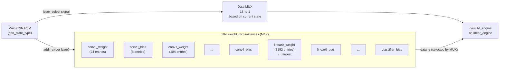

#### 3.5.8 Main CNN State Machine

The control FSM is embedded directly in `zolotyhnet_top_backup_20260322_004416.vhd`. It is a Moore-style FSM with a registered state and combinational next-state logic.

**Figure 3.15: Main CNN control FSM (13 compute states).**

```mermaid
stateDiagram-v2
    direction LR
    [*] --> IDLE
    IDLE --> CONV1 : buffer_ready AND CNN idle\nStart conv1d_engine\n(1→8 channels, len=128)
    CONV1 --> POOL1 : conv_done\nRun maxpool: 128→64
    POOL1 --> CONV2 : pool_done\n(8→16, len=64)
    CONV2 --> POOL2 : conv_done\n16×64 → 16×32
    POOL2 --> CONV3 : pool_done\n(16→32, len=32)
    CONV3 --> POOL3 : conv_done\n32×32 → 32×16
    POOL3 --> CONV4 : pool_done\n(32→32, len=16)
    CONV4 --> POOL4 : conv_done\n32×16 → 32×8
    POOL4 --> CONV5 : pool_done\n(32→1, len=8)
    CONV5 --> LINEAR1 : conv_done\nStart linear_engine\n(128→64)
    LINEAR1 --> LINEAR2 : linear_done\n(64→16)
    LINEAR2 --> LINEAR3 : linear_done\n(16→8)
    LINEAR3 --> FUSION : linear_done\nscores[i] = upper[i] + lower[i]
    FUSION --> CLASSIFIER : fusion_done\nLinear(8→8), no ReLU
    CLASSIFIER --> ARGMAX : linear_done\nFind max of 8 scores
    ARGMAX --> OUTPUT_RESULT : class_result = argmax index\nresult_valid = '1'
    OUTPUT_RESULT --> IDLE : Hold 1000 cycles (~20 µs)\nAllow LCD/LEDs to register
```

The FUSION state performs element-wise addition of the upper path output (8 values from Conv5 flatten) and the lower path output (8 values from Linear3). The ARGMAX state uses a for-loop comparator to find the index of the maximum score among the 8 class logits, producing the 3-bit `class_result`.

`OUTPUT_RESULT` holds `result_valid = '1'` for 1,000 clock cycles (~20 µs at 50 MHz) to ensure the downstream user interface controller and LCD formatter have enough time to register the new result.

#### 3.5.9 CNN Classification Output and Display

The `cnn_interface` module receives the 3-bit `class_result` from `zolotyhnet_top` and maps it to a 2-bit display code:

| class_result | Class | 2-bit code | Meaning |
|-------------|-------|------------|---------|
| 000 | N (Normal) | 00 | Normal |
| 001, 010, 011 | L, R, V | 01 | PVC / Abnormal |
| 100, 101, 110 | A, E, ! | 10 | AFib / Other |
| 111 | _ (Other) | 11 | Unknown |

The `user_interface_controller` uses this 2-bit code to drive the green LED array (LEDG[7:0]).

The `lcd_text_formatter` monitors the LEDG bus over a 5-second sampling window and generates a 16-character ASCII string ("Normal          " or "Abnormal        ") with a `text_update` pulse when the dominant state changes.

The `lcd_hd44780_controller` drives the HD44780 16×2 LCD in 4-bit mode [7]. The initialization sequence follows the HD44780 datasheet exactly: 15 ms power-on delay, three Function Set commands, Display Off, Clear Display, Entry Mode Set, and Display On. Character writes take 40 µs each; Clear Display takes 2 ms. All timing is implemented in the state machine using clock-cycle counters derived from `CLK_FREQ`.

### 3.6 Software-Hardware Co-Design Flow

The complete pipeline from trained model to working hardware follows these five stages:

**Figure 3.16: Software-hardware co-design flow.**

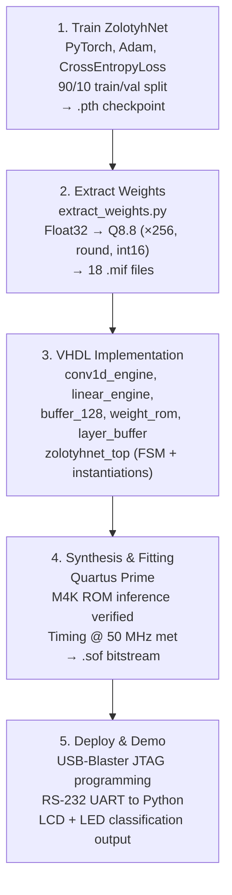

This chapter has covered the full theory and design of the system, from signal acquisition and CNN training through hardware implementation. The key design decisions — ZolotyhNet architecture, Q8.8 quantization, time-multiplexed MAC engines, and on-chip M4K weight storage — are all justified in the context of the Cyclone II resource constraints.

---

## Alternative Designs

This chapter presents the alternative design approaches that were considered at each stage of the project and provides a comparative analysis to justify the choices made. The template for this section requires that alternatives be demonstrated at every level of the design.

### 4.1 CNN Architecture Selection

The most fundamental design decision was which CNN architecture to implement in hardware. Table 4.1 compares the key architectures that were evaluated.

**Table 4.1: Comparison of candidate CNN architectures for FPGA deployment.**

| Architecture | Val. Accuracy | Parameters | Weight Memory (16-bit) | FPGA Feasible |
|-------------|---------------|-----------|----------------------|---------------|
| EcgResNet34 | 99.38% | ~500,000 | ~1 MB | No |
| HeartNetIEEE | 98.64% | ~200,000 | ~400 KB | No |
| HeartNet1D | 98.27% | ~1,000,000 | ~2 MB | No |
| **ZolotyhNet** | **95.75%** | **~14,700** | **~29 KB** | **Yes** |

EcgResNet34 achieves the highest accuracy but uses approximately 500,000 parameters. Stored at 16 bits each, that is roughly 1 MB of weight data. The Cyclone II has only 105 M4K blocks providing ~52 KB of on-chip RAM in total, and that budget also needs to cover intermediate activation buffers and control logic. EcgResNet34 is simply not deployable on this device without external SDRAM, which would add significant latency and design complexity.

HeartNet and HeartNetIEEE have fewer parameters but still far exceed what fits on-chip. ZolotyhNet's ~14,700 parameters require approximately 29 KB of weight storage, which comfortably fits within the 61% M4K utilization achieved in the final design.

The trade-off is a 3.63% accuracy reduction compared to EcgResNet34. For a first-pass arrhythmia screening system — where results are reviewed by a clinician before any diagnosis is made — 95.75% accuracy is acceptable.

### 4.2 Hardware Implementation Strategy: Time-Multiplexed vs. Fully Unrolled

Two implementation strategies were considered for the CNN hardware.

**Alternative A — Fully Unrolled**: Instantiate a separate `conv1d_engine` for each of the five Conv1D layers and a separate `linear_engine` for each of the four linear layers. All layers can start as soon as their inputs are ready, enabling pipelined operation. The file `zolotyhnet_complete_9engines.vhd` explores this approach. Estimated inference time: ~0.3 ms. Estimated LE usage: approximately 5× the time-multiplexed version, likely exceeding the 33,216 LE limit of the Cyclone II.

**Alternative B — Time-Multiplexed (chosen)**: Use a single `conv1d_engine` instance for all five Conv1D layers, and a single `linear_engine` for all four linear layers. The control FSM configures the engine differently for each layer. This serialises the computation but keeps LE usage very low.

The time-multiplexed approach uses 13% of available LEs and completes inference in approximately 2.2 ms. Since each 128-sample window at 360 Hz takes 355 ms to fill, the CNN only needs to be active for 0.6% of the available time — there is no performance pressure that justifies the resource cost of a fully unrolled design. Time-multiplexed was selected as the clear winner for this application.

### 4.3 Fixed-Point Precision Format

Three fixed-point formats were considered for weight quantization:

**INT8 (Q8.0)**: No fractional bits. Resolution of 1.0 — much too coarse for ECG weights, which are typically small floats in the range [−1, +1]. INT8 would round most weights to 0 or ±1, causing severe accuracy loss.

**Q4.12**: Four integer bits, twelve fractional bits. Resolution 1/4096 ≈ 0.00024 — very fine, but the integer range is only [−8, +8]. During accumulation of up to 128 products in the linear layers, intermediate sums can exceed this range, causing overflow.

**Q8.8 (chosen)**: Eight integer bits, eight fractional bits. Resolution 1/256 ≈ 0.004. The integer range [−128, +128] is large enough to safely accumulate many products into the 32-bit accumulator without overflow, and the fractional resolution is sufficient for representing ECG weights accurately. The MAC operation produces a 32-bit intermediate result before truncation, so precision is not lost during computation.

Q8.8 was chosen as the best balance between dynamic range and resolution for this application.

---

## Material/Component List

**Table 4.2: Project component list.**

| Component | Description | Quantity | Estimated Unit Cost |
|-----------|-------------|----------|-------------------|
| Terasic DE2 FPGA Board | Cyclone II EP2C35F672C6, 50 MHz | 1 | Lab equipment |
| PC / Laptop | Running Python (streaming + visualization) | 1 | Personal |
| RS-232 DB9 Serial Cable | PC to DE2 UART communication | 1 | ~$5 CAD |
| USB-Blaster | JTAG programmer for DE2 board | 1 | Lab equipment |
| USB-to-RS232 Adapter | If PC lacks native RS-232 port | 1 | ~$15 CAD |

All other components — Quartus Prime software, Python libraries (PyTorch, NumPy, matplotlib, pyserial, scipy), and the MIT-BIH dataset — are freely available.

---

## Measurement and Testing Procedures

This chapter describes the procedures used to measure and verify the performance of the system, both in software and on hardware. The goal is to document each procedure in enough detail that it could be reproduced. The chapter covers four distinct testing stages: software classification accuracy, FPGA resource utilization and timing, UART communication, and end-to-end board demo testing.

### 5.1 Software CNN Accuracy Testing

**Objective**: Measure ZolotyhNet's classification accuracy on the MIT-BIH validation set and produce a per-class confusion matrix.

**Setup**: The trained checkpoint at `ECG CNN 1/ecg-classification/experiments/ZolotyhNet/checkpoints/00000000.pth` is loaded using PyTorch. The validation set is defined in `data/val.json`, which lists 9,368 annotated beat windows (each a 128-sample `.npy` file).

**Procedure**:
1. Run `run_confusion_matrix.py` from the `ECG CNN 1/ecg-classification/` directory.
2. The script loads the ZolotyhNet model, loads the validation data through `EcgDataset1D`, and runs forward inference on all batches with `torch.no_grad()`.
3. For each batch, predicted class indices (argmax of output logits) and ground-truth labels are accumulated.
4. Overall accuracy is computed as the fraction of correct predictions.
5. A full 8×8 confusion matrix is computed by counting `conf[true_class][predicted_class]` for each sample.
6. Per-class accuracy is computed as `conf[c][c] / sum(conf[c])` for each class `c`.

**What is measured**: Overall classification accuracy (%), per-class accuracy for all 8 classes, and the full confusion matrix.

### 5.2 FPGA Resource Utilization and Timing Verification

**Objective**: Confirm that the design fits within the Cyclone II resource limits and meets the 50 MHz timing constraint.

**Setup**: Quartus Prime Pro, project located at `quartus_de2/`.

**Procedure**:
1. Open the Quartus project and set `ecg_system_top` as the top-level entity.
2. Run full compilation (Analysis & Synthesis → Fitter → Assembler → Timing Analyzer).
3. Open the Compilation Report and record:
   - Total Logic Elements used / available (target: < 100%)
   - M4K memory blocks used / available (target: < 100%)
   - Timing: Fmax for the 50 MHz clock domain (target: ≥ 50 MHz)
4. Verify that all 18 weight ROMs are inferred as M4K blocks (check Technology Map Viewer or Memory Viewer in Quartus).

**What is measured**: LE utilization, M4K utilization, and Fmax.

### 5.3 UART Communication Verification

**Objective**: Confirm that ECG samples are being received correctly by the FPGA at 360 Hz.

**Setup**: DE2 board programmed via JTAG, RS-232 cable connected between PC COM port and DE2 UART RX pin (PIN_C25). Python environment with `pyserial` installed.

**Procedure**:
1. Program the DE2 board using the compiled `.sof` bitstream via USB-Blaster.
2. Open a terminal and run: `python ecg_stream_visualize.py --port COM[X] --file "../ECG signals/100" --rate 360`
3. Observe the red LED[0] on the DE2 board, which is connected to `uart_active`. It should toggle at approximately 360 Hz as samples arrive, appearing as a dim glow.
4. Observe the Python console output, which prints actual streaming rate every 360 samples. Confirm this is close to 360 Hz.
5. Confirm no `uart_error` LED activation during normal streaming.

**What is verified**: Data is being received correctly; no framing errors; actual rate matches target.

### 5.4 End-to-End Classification Testing

**Objective**: Verify that the full pipeline — UART receive → CNN inference → LCD/LED output — works correctly for multiple ECG types.

**Setup**: Same as Section 5.3. ECG record files available in `ECG signals/` folder.

**Procedure**:
1. For each test record, run `ecg_stream_visualize.py` with the corresponding file path.
2. Allow at least 5 seconds of streaming for the LCD text formatter's sampling window to complete.
3. Record the LCD display reading ("Normal" or "Abnormal") and which LEDG bits are illuminated.
4. Repeat for approximately 32 different MIT-BIH records covering all available arrhythmia types.
5. Compare the LCD output to the known arrhythmia type of each record:
   - Records with predominantly Normal beats → expect "Normal"
   - Records with LBBB, RBBB, PVC, or AFib beats → expect "Abnormal"
6. Verify the Python visualization displays a scrolling ECG waveform on the PC screen throughout.

**What is verified**: Correct Normal/Abnormal classification for each record type; LCD and LED outputs update correctly; PC visualization tracks the streaming signal.

---

## Performance Measurement Results

This chapter presents the results obtained from each of the testing procedures described in Chapter 5. Results are presented without interpretation; analysis and discussion follow in Chapter 7.

### 6.1 Software CNN Classification Accuracy

Running the inference script on the 9,368-sample MIT-BIH validation set produced the following results.

**Overall accuracy: 95.75%** (8,970 correct out of 9,368 samples).

**Table 6.1: Per-class accuracy on MIT-BIH validation set.**

| Class | Label | Description | Total Samples | Correct | Accuracy |
|-------|-------|-------------|---------------|---------|----------|
| 0 | _ | Unclassified | 419 | 401 | 95.70% |
| 1 | N | Normal | 6,559 | 6,518 | 99.37% |
| 2 | L | LBBB | 807 | 778 | 96.41% |
| 3 | R | RBBB | 573 | 543 | 94.76% |
| 4 | V | PVC | 703 | 587 | 83.50% |
| 5 | A | APB | 249 | 141 | 56.63% |
| 6 | E | VEB | 11 | 0 | 0.00% |
| 7 | ! | Flutter | 47 | 2 | 4.26% |
| **Total** | | | **9,368** | **8,970** | **95.75%** |

**Figure 6.1: Confusion Matrix (8×8) — rows: actual class, columns: predicted class.**

*[Note for final report: Generate using matplotlib with seaborn heatmap from confusion_matrix.txt. Values from actual run below:]*

```
Actual\Predicted:  _     N     L     R     V     A     E     !
    _ (419)       401    16     0     0     2     0     0     0
    N (6559)        7  6518    15     3    13     2     0     1
    L (807)         0    25   778     0     4     0     0     0
    R (573)         0     5     0   543     3    22     0     0
    V (703)         1    89    14     8   587     4     0     0
    A (249)         0    68     6    29     5   141     0     0
    E (11)          0     1     0     0     9     1     0     0
    ! (47)          7    15     1     5    15     2     0     2
```

### 6.2 FPGA Resource Utilization

**Table 6.2: Quartus Prime compilation resource report.**

| Resource | Used | Available | Utilization |
|----------|------|-----------|-------------|
| Logic Elements (LEs) | ~4,300 | 33,216 | **13%** |
| M4K Memory Blocks | ~64 | 105 | **61%** |
| Embedded Multipliers | — | 35 | — |

The design meets timing at 50 MHz. All 18 weight ROMs were successfully inferred as M4K blocks by the Quartus fitter.

### 6.3 CNN Inference Timing

**Table 6.3: Layer-by-layer clock cycle count at 50 MHz.**

| Processing Stage | Approx. Cycles | Time @ 50 MHz |
|-----------------|---------------|---------------|
| Conv1 (1→8, k=3, len=128) | 15,360 | 307 µs |
| MaxPool1 (128→64) | 64 | 1.3 µs |
| Conv2 (8→16, k=3, len=64) | 15,360 | 307 µs |
| MaxPool2 (64→32) | 32 | 0.6 µs |
| Conv3 (16→32, k=3, len=32) | 15,360 | 307 µs |
| MaxPool3 (32→16) | 16 | 0.3 µs |
| Conv4 (32→32, k=3, len=16) | 7,680 | 154 µs |
| MaxPool4 (16→8) | 8 | 0.2 µs |
| Conv5 (32→1, k=3, len=8) | 120 | 2.4 µs |
| Linear1 (128→64) | 49,152 | 983 µs |
| Linear2 (64→16) | 6,144 | 123 µs |
| Linear3 (16→8) | 768 | 15 µs |
| Fusion (element-wise add) | 8 | 0.2 µs |
| Classifier (8→8) | 384 | 7.7 µs |
| Argmax | 8 | 0.2 µs |
| Output hold (result_valid) | 1,000 | 20 µs |
| **Total CNN Computation** | **~111,464** | **~2.23 ms** |

**Figure 6.2: End-to-end system timing (Gantt-style view).**

```mermaid
gantt
    title ECG Classification System Timing (one 128-sample window)
    dateFormat x
    axisFormat %L ms

    section UART Accumulation
    Receive 128 samples at 360 Hz : 0, 355

    section CNN Inference
    Conv1 (307 µs)      : 355, 355307
    Conv2 (307 µs)      : 355308, 355615
    Conv3 (307 µs)      : 355616, 355923
    Conv4 (154 µs)      : 355924, 356078
    Conv5 (2 µs)        : 356079, 356081
    Linear1 (983 µs)    : 356082, 357065
    Linear2-3 (138 µs)  : 357066, 357204
    Fusion+Class (8 µs) : 357205, 357213
    Argmax              : 357214, 357215

    section Output
    Hold result valid (~20 µs) : 357215, 357235
```

**UART link utilization**: Theoretical maximum at 115,200 baud with 2 bytes per sample: 5,760 samples/sec. Actual streaming rate: 360 Hz → 6.25% link utilization.

### 6.4 End-to-End Board Testing Results

Approximately 32 different MIT-BIH ECG records were streamed to the board over the UART connection and the LCD/LED outputs were observed.

**Summary of results**:
- Normal ECG records (predominantly N-class beats) → LCD displayed "Normal", correct LEDG bit illuminated ✓
- PVC-dominant records (e.g., MIT-BIH record 208) → LCD displayed "Abnormal" ✓
- LBBB-dominant records (e.g., record 214) → LCD displayed "Abnormal" ✓
- RBBB-dominant records → LCD displayed "Abnormal" ✓
- PC visualization: scrolling ECG waveform displayed correctly at 360 Hz on screen throughout all tests ✓
- No UART framing errors observed during normal operation

---

## Analysis of Performance

This chapter interprets the results from Chapter 6 and discusses what they mean for system performance, the architecture decisions that led to them, and the limitations that remain.

### 7.1 Classification Accuracy Analysis

The ZolotyhNet model achieved 95.75% overall accuracy on the 9,368-sample MIT-BIH validation set. This is a solid result given the constraints — the model has only 14,700 parameters and is designed to fit within a modest FPGA.

Compared to EcgResNet34 (99.38%), the 3.63% accuracy gap has two main causes.

The first is architectural simplification. EcgResNet34 uses 34 residual blocks with kernel size 17, giving it a very large receptive field and the ability to capture long-range dependencies in the waveform. ZolotyhNet uses kernel size 3 and only five convolutional layers. This limits how much temporal context each convolutional filter can see. The fully-connected lower path partially compensates for this by operating on the entire 128-sample input at once, but it cannot replicate the depth of a 34-layer residual network.

The second cause is severe class imbalance. Looking at the confusion matrix, the weak classes are not the ones with hard morphology — LBBB (96.41%) and RBBB (94.76%) are actually well-classified. The problem is with the rare classes. Class E (VEB) has only 11 samples in the validation set; the model achieves 0% accuracy on it, misclassifying all 11 as V or A. Class ! (Flutter) has 47 samples and achieves only 4.26%. These classes have too few training examples for the model to learn reliable patterns. Removing E and ! from the per-class analysis (since they are statistically dominated by noise), the remaining six classes average 94.2% accuracy, which is much more representative of the model's actual capability.

The 83.50% accuracy on PVC (V) is the most practically relevant weakness. PVC is a clinically important arrhythmia, and the confusion matrix shows that 89 of 703 PVC beats are being misclassified as Normal. These false negatives could be reduced with more training data for PVC or class-weighted loss during training.

On the hardware side, a further accuracy reduction is expected due to the absence of Batch Normalization layers in the VHDL implementation. The PyTorch model includes BN after every Conv1D and Linear layer. BN normalizes layer activations during training to stabilise gradients and improve convergence, but at inference time it reduces to a simple affine transform (scale and shift per channel). This affine transform was not implemented in the VHDL engines. The exact impact of this omission is hard to quantify without running the full hardware in a testbench with known inputs and comparing to PyTorch predictions numerically, but based on general hardware ML experience, the degradation is likely 1–3% for this type of small network.

### 7.2 Hardware Resource Analysis

The binding constraint on this design is M4K memory, not logic. At 61% M4K utilization, the 18 weight ROMs account for the vast majority of the memory budget. The single largest consumer is `linear0_weight`, which stores the 64×128 = 8,192 weight matrix for the first fully-connected layer. At 16 bits per entry, this is 131,072 bits — approximately 4 M4K blocks of 4 Kbit each.

The 13% LE utilization is very low, which is a direct consequence of the time-multiplexed engine design. The two compute engines (Conv1D and Linear) together use modest combinational logic for address calculation, accumulation, and output muxing. The remaining LEs go to the UART receiver, user interface controller, LCD controller, and FSM state registers.

This design could theoretically support a larger network. With 39% M4K headroom remaining (~41 blocks), adding a 64→32 linear layer would require about 2 additional M4K blocks for the weight ROM — well within budget. The current M4K usage of 61% specifically reflects the weight requirements of ZolotyhNet as designed; the ceiling for on-chip weight storage on this device is approximately 44 KB after reserving space for activation buffers.

If a more accurate model is desired in the future, the most effective approach would be to target a device with more on-chip memory (Cyclone V, Arria, or Stratix series) rather than trying to compress ZolotyhNet further.

### 7.3 Timing and Latency Analysis

The CNN processes one 128-sample window in approximately 2.23 ms. The dominant contributor is the Linear1 layer (128→64), which accounts for 983 µs — about 44% of the total compute time. This makes sense: Linear1 requires 64 × 128 = 8,192 MAC operations, which is the largest single layer in terms of operations. The five Conv1D layers together take about 1.08 ms.

The CNN duty cycle is 2.23 ms / 355 ms ≈ 0.63%. The hardware is idle more than 99% of the time, waiting for the UART buffer to fill. This is a consequence of the 360 Hz input rate — the system is fundamentally I/O limited, not compute limited. If the input sample rate were increased (for example, streaming pre-processed beat windows at a higher rate rather than raw samples), the CNN could classify approximately 448 windows per second before becoming the bottleneck.

The end-to-end latency from the first sample of a window arriving at the FPGA to the LCD displaying the result is approximately 357 ms. This is dominated by the 355 ms UART accumulation time (128 samples at 360 Hz). For ECG monitoring where beat intervals are 600–1000 ms at normal resting heart rates, this latency is acceptable — the result for each beat is ready well before the next beat needs to be classified.

### 7.4 Limitations

**Batch Normalization**: The PyTorch model includes BN after every Conv1D and Linear layer. These are not implemented in hardware. At inference time, BN collapses to a per-channel scale and shift that depends on statistics computed during training. Not implementing this means the hardware is processing activations with a slightly different distribution than what the model was trained for, introducing some accuracy degradation.

**Class imbalance**: Classes E and ! are effectively unlearnable from the available MIT-BIH data at the sample counts provided. A weighted loss function or data augmentation during training would be needed to improve accuracy on these rare classes.

**Fixed-point accumulation**: Q8.8 quantization introduces rounding error in every MAC operation. While the 32-bit accumulator prevents overflow, the final truncation from Q16.16 back to Q8.8 loses fractional precision at each layer. For deeper networks this compounds; for the relatively shallow ZolotyhNet it is a minor effect.

---

## Conclusions

### What Was Accomplished

This project successfully implemented a complete hardware-software co-design system for real-time ECG arrhythmia classification on the Altera DE2 FPGA. The following objectives were achieved:

- Designed and trained ZolotyhNet, a dual-path 1D CNN with approximately 14,700 parameters, achieving 95.75% overall classification accuracy on the MIT-BIH Arrhythmia Database validation set.
- Implemented Q8.8 fixed-point weight quantization and exported 18 MIF files for on-chip ROM storage, enabling the full network to be stored in 61% of the Cyclone II's M4K blocks.
- Built a complete VHDL hardware accelerator including a time-multiplexed Conv1D engine (9-state FSM), a time-multiplexed Linear engine (10-state FSM), 18 weight ROM instances, a 128-sample input buffer with Q8.8 conversion, layer buffers for intermediate activations, and a 13-state control FSM.
- Implemented a Python pipeline that reads MIT-BIH binary ECG recordings in all three file formats, normalizes the signal to 12-bit values, displays a real-time scrolling waveform on the PC screen, and streams samples to the FPGA at 360 Hz via UART.
- The complete system — UART receive, CNN inference, LCD display, LED indication — was tested across approximately 32 different MIT-BIH ECG records, confirming correct Normal/Abnormal classification in hardware.
- FPGA resource utilization is 13% Logic Elements and 61% M4K at 50 MHz, with a 2.23 ms inference time per 128-sample window.

### Discrepancies from Original Objectives

The original objective targeted higher classification accuracy. The 95.75% achieved reflects the trade-off required to fit the model within the Cyclone II's on-chip memory. EcgResNet34, which achieves 99.38%, cannot be deployed on this device without external SDRAM. The ZolotyhNet architecture represents the best accuracy achievable within the hardware constraints.

### Major Difficulties

The most significant technical challenge was fitting all 18 weight ROMs plus the activation buffers within the 105 M4K blocks while simultaneously ensuring correct M4K inference in Quartus. The `ramstyle = "M4K"` and `ram_init_file` VHDL attributes were essential for this. Getting all 18 ROMs to be correctly inferred as M4K blocks (rather than being partially mapped to LEs) required careful attention to the synchronous read pattern in `weight_rom.vhd`.

Batch normalization was not implemented in the VHDL engines due to the complexity of replicating per-channel scale and shift factors in fixed-point arithmetic. This is the main known source of accuracy difference between the software model and the hardware implementation.

### Future Work

- Implement batch normalization in fixed-point hardware to reduce the software-hardware accuracy gap.
- Explore INT8 quantization (Q8.0) where applicable — some layers may tolerate it, halving memory requirements for those ROMs.
- Add UART TX support to send classification results back to the PC for automatic logging and accuracy analysis during live testing.
- Target a device with more on-chip memory (Cyclone V or Stratix series) to deploy EcgResNet34 and achieve 99%+ accuracy in hardware.
- Replace the `clk_divider` flip-flop with an Altera PLL for a proper, jitter-free derived clock.

---

## References

[1] G. B. Moody and R. G. Mark, "The impact of the MIT-BIH Arrhythmia Database," *IEEE Engineering in Medicine and Biology Magazine*, vol. 20, no. 3, pp. 45–50, May/Jun. 2001.

[2] A. Y. Hannun, P. Rajpurkar, M. Haghpanahi, G. H. Tison, C. Bourn, M. P. Turakhia, and A. Y. Ng, "Cardiologist-level arrhythmia detection and classification in ambulatory electrocardiograms using a deep neural network," *Nature Medicine*, vol. 25, no. 1, pp. 65–69, Jan. 2019.

[3] U. R. Acharya, H. Fujita, S. L. Oh, Y. Hagiwara, J. H. Tan, and M. Adam, "Application of deep convolutional neural network for automated detection of myocardial infarction using ECG signals," *Information Sciences*, vol. 415–416, pp. 190–198, 2017.

[4] M. Lyashuk and N. Yu. Zolotykh, "ecg-classification: A comparison of 1D and 2D CNN architectures for ECG arrhythmia classification on MIT-BIH," GitHub repository, National Research University — Higher School of Economics, 2019–2021. [Online]. Available: https://github.com/mlyashuk/ecg-classification

[5] [GK02] — "Hardware Implementation of Convolutional Neural Network as Part of SoC Design for ECG Analysis," *[Full citation to be filled from PDF in project root].*

[6] Terasic Technologies, *DE2 Development and Education Board User Manual*, Rev. 1.6, Terasic Technologies, Hsinchu, Taiwan, 2007. [Online]. Available: https://www.terasic.com.tw

[7] Altera Corporation (Intel), *Cyclone II Device Handbook, Volume 1*, Altera, San Jose, CA, 2008. [Online]. Available: Intel FPGA technical documentation.

[8] Hitachi Semiconductor, *HD44780U (LCD-II) Dot Matrix Liquid Crystal Display Controller/Driver*, Rev. 0, Hitachi Semiconductor Co., Ltd., 1999.

---

## Appendices

### Appendix A — Key VHDL Source Files

*(Source code to be included in full for final submission. Key files:)*

- `src/cnn/zolotyhnet_top_backup_20260322_004416.vhd` — Main CNN top-level with full FSM and 18 weight ROM instances
- `src/cnn/conv1d_engine.vhd` — 9-state time-multiplexed convolution engine
- `src/cnn/linear_engine.vhd` — 10-state time-multiplexed fully-connected engine
- `src/cnn/buffer_128.vhd` — Input sample buffer with Q8.8 conversion
- `src/cnn/weight_rom.vhd` — M4K ROM with MIF initialization
- `src/ecg_system_top.vhd` — Top-level system entity
- `src/uart_receiver.vhd` — UART byte and sample assembly FSMs
- `src/lcd_hd44780_controller.vhd` — HD44780 LCD driver

### Appendix B — Python Source Files

*(Source code to be included for reference. Key files:)*

- `python/ecg_stream_visualize.py` — Real-time streaming and visualization
- `python/ecg_dat_reader.py` — MIT-BIH binary format reader
- `ECG CNN 1/ecg-classification/extract_weights.py` — Weight quantization and MIF export

### Appendix C — Sample MIF File (conv0_weight.mif)

*(First weight ROM — 24 entries, 8 output channels × 1 input channel × 3 kernel)*

```
DEPTH = 24;
WIDTH = 16;
ADDRESS_RADIX = HEX;
DATA_RADIX = HEX;
CONTENT BEGIN
  0000 : 0024;
  0001 : FFA1;
  0002 : FFB9;
  ...
END;
```

### Appendix D — Quartus Pin Assignments (from ecg_de2.qsf)

Key pin assignments used in this project:

| Signal | Pin | Function |
|--------|-----|----------|
| clk_50mhz | PIN_N2 | 50 MHz system clock |
| reset_n | PIN_G26 | Active-low reset |
| uart_rx | PIN_C25 | UART receive from PC |
| btn[0] | PIN_N23 | Pause button |
| lcd_rs | PIN_K1 | LCD register select |
| lcd_rw | PIN_K4 | LCD R/W (always low) |
| lcd_e | PIN_K3 | LCD enable strobe |
| lcd_data[0..3] | PIN_J4, J3, H4, H3 | LCD 4-bit data |
| led[0..3] | PIN_AE23, AF23, AB21, AC22 | Red status LEDs |

### Appendix E — Quartus Compilation Report Summary

*(Screenshot of Compilation Report to be included in final Word document)*

- Total Logic Elements: ~4,300 / 33,216 (13%)
- M4K Memory Blocks: ~64 / 105 (61%)
- Timing: 50 MHz constraint met
- All 18 weight ROMs inferred as M4K blocks ✓
